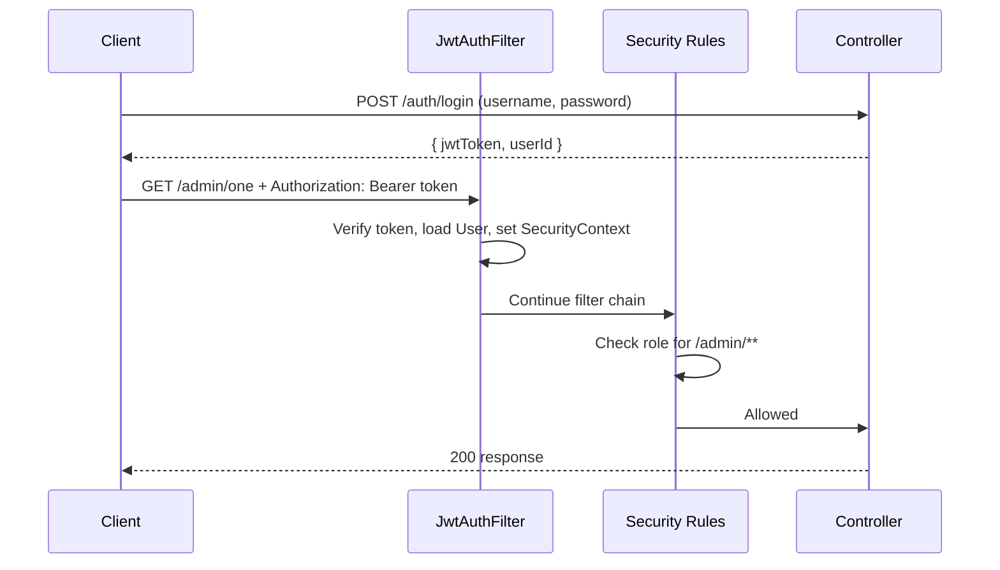

# Authentication 
### (Spring Security 6 with Jwt and Oauth2)


A stateless authentication and authorization service built with **Spring Boot** and **Spring Security**. It supports:

- **Email + password** signup and login (passwords hashed with BCrypt)
- **JWT** access tokens (signed with HMAC, 1 hour expiry) sent as `Authorization: Bearer <token>`
- **OAuth2 social login** (Google, GitHub, Facebook), which ends by issuing the same JWT
- **Role-based access control** (`ADMIN`, `DOCTOR`, `PATIENT`)
- Centralised JSON error responses

---

## Tech Stack

| Area | Technology |
| --- | --- |
| Language / Build | Java 21, Maven (wrapper included) |
| Framework | Spring Boot 4.1.1 (`spring-boot-starter-parent`) |
| Security | Spring Security, OAuth2 Client |
| Tokens | JJWT 0.13.0 (`jjwt-api`, `jjwt-impl`, `jjwt-jackson`) |
| Persistence | Spring Data JPA / Hibernate, MySQL |
| Utilities | Lombok, Spring Boot DevTools |

---

## Directory Structure

```
Authentication/
├── pom.xml                         # Maven dependencies and build config
├── mvnw / mvnw.cmd                 # Maven wrapper scripts
├── .mvn/wrapper/                   # Maven wrapper properties
└── src/
    ├── main/
    │   ├── java/com/SpringBoot/Authentication/
    │   │   ├── AuthenticationApplication.java   # Spring Boot entry point
    │   │   │
    │   │   ├── config/
    │   │   │   ├── SecurityBeanConfig.java      # AuthenticationManager + BCrypt PasswordEncoder beans
    │   │   │   └── WebSecurityConfig.java       # SecurityFilterChain: routes, roles, JWT filter, OAuth2 login
    │   │   │
    │   │   ├── controller/
    │   │   │   ├── AuthController.java          # POST /auth/signup, POST /auth/login
    │   │   │   └── HomeController.java          # Public and admin sample endpoints
    │   │   │
    │   │   ├── service/
    │   │   │   ├── AuthService.java             # Signup, login, and OAuth2 login/signup logic
    │   │   │   ├── CustomUserDetailsService.java# Loads a User by username for Spring Security
    │   │   │   ├── JwtAuthFilter.java           # Validates the Bearer token on every request
    │   │   │   └── OAuth2SuccessHandler.java    # Runs after a successful social login, returns JWT as JSON
    │   │   │
    │   │   ├── entity/
    │   │   │   ├── User.java                    # Implements UserDetails; username, password, roles, provider info
    │   │   │   ├── Patient.java                 # Profile row that shares its primary key with User
    │   │   │   ├── RoleType.java                # ADMIN, PATIENT, DOCTOR
    │   │   │   └── AuthProviderType.java        # EMAIL, GOOGLE, GITHUB, FACEBOOK, TWITTER
    │   │   │
    │   │   ├── dto/
    │   │   │   ├── LoginRequestDto.java         # { username, password }
    │   │   │   ├── LoginResponseDto.java        # { jwtToken, userId }
    │   │   │   ├── SignUpRequestDto.java        # { username, password, name, roles }
    │   │   │   └── SignUpResponseDto.java       # { id, username }
    │   │   │
    │   │   ├── repo/
    │   │   │   ├── UserRepository.java          # findByUsername, findByProviderIdAndAuthProviderType
    │   │   │   └── PatientRepository.java
    │   │   │
    │   │   ├── util/
    │   │   │   ├── AuthUtil.java                # JWT create/parse + OAuth2 provider helpers
    │   │   │   └── HttpCookieOAuth2AuthorizationRequestRepository.java  # Keeps OAuth2 state in a cookie
    │   │   │
    │   │   └── error/
    │   │       ├── ApiError.java                # Error body: timestamp, error, statusCode
    │   │       └── GlobalExceptionHandler.java  # Maps exceptions to HTTP status codes
    │   │
    │   └── resources/
    │       └── application.properties           # DB, JPA, and JWT secret configuration
    │
    └── test/java/com/SpringBoot/Authentication/
        └── AuthenticationApplicationTests.java
```

---

## How It Works

### 1. Signup (`POST /auth/signup`)

1. `AuthController` passes the `SignUpRequestDto` to `AuthService.signup`.
2. `signUpInternal` checks that the username is not already taken (otherwise throws `User Already Exists`).
3. A `User` is created. For the `EMAIL` provider the password is hashed with BCrypt before saving.
4. A linked `Patient` row is created (same primary key as the user via `@MapsId`), using the supplied name and using the username as the email.
5. The response contains the new user's `id` and `username`.

### 2. Login (`POST /auth/login`)

1. `AuthService.login` calls `AuthenticationManager.authenticate` with the username and password.
2. Spring Security loads the user through `CustomUserDetailsService` and verifies the BCrypt hash.
3. `AuthUtil.generateAccessToken` builds a JWT with:
    - `subject` = username
    - `userId` claim
    - `issuedAt` and an expiry of **1 hour**
    - signature using the key derived from `JWT_SECRET_KEY`
4. The response is `{ "jwtToken": "...", "userId": 1 }`.

### 3. Authenticating Requests (JWT filter)

`JwtAuthFilter` runs **before** `UsernamePasswordAuthenticationFilter` on every request:

1. Reads the `Authorization` header. If it is missing or does not start with `Bearer `, the request continues unauthenticated.
2. Parses and verifies the token signature and expiry, and extracts the username.
3. Loads the `User` from the database and places a `UsernamePasswordAuthenticationToken` (with the user's authorities) into the `SecurityContext`.
4. Any exception (expired or invalid token) is passed to `HandlerExceptionResolver`, so `GlobalExceptionHandler` can return a clean JSON error.

Sessions are **stateless** (`SessionCreationPolicy.STATELESS`) and CSRF is disabled, since every request carries its own token.



### 4. Authorization Rules

Defined in `WebSecurityConfig`:

| Path | Access |
| --- | --- |
| `/`, `/public/**`, `/auth/**` | Public |
| `/admin/**` | `ADMIN` only |
| `/doctors/**` | `DOCTOR` or `ADMIN` |
| Everything else | Any authenticated user |

Roles are stored as `ROLE_<NAME>` authorities (for example `ROLE_ADMIN`) in `User.getAuthorities()`.

### 5. OAuth2 Social Login (Google / GitHub / Facebook)

1. The client starts login at `/oauth2/authorization/{registrationId}` (for example `/oauth2/authorization/google`).
2. Because the app is stateless, the OAuth2 authorization request is stored in a short-lived (180 seconds), HTTP-only cookie by `HttpCookieOAuth2AuthorizationRequestRepository` instead of an HTTP session.
3. After the provider redirects back, `OAuth2SuccessHandler` calls `AuthService.handleOAuth2LoginRequest`, which:
    - Resolves the provider type and the provider's user id (`sub` for Google, `id` for GitHub/Facebook).
    - Looks up an existing user by provider id and provider type.
    - If none exists and the email is unused, **signs the user up** automatically with the `PATIENT` role.
    - If the email already belongs to an account created with a different provider, it rejects the login with a `BadCredentialsException`.
4. The handler writes `{ "jwtToken": "...", "userId": ... }` directly as the JSON response, so the client receives the same JWT as a normal login.

### 6. Error Handling

`GlobalExceptionHandler` returns an `ApiError` body (`timestamp`, `error`, `statusCode`):

| Exception | HTTP Status |
| --- | --- |
| `UsernameNotFoundException` | 404 |
| `AuthenticationException` | 401 |
| `JwtException` | 401 |
| `AccessDeniedException` | 403 |
| Any other `Exception` | 500 |

Errors thrown inside filters (JWT filter, OAuth2 failure, entry point) are forwarded to this handler through `HandlerExceptionResolver`.

---

## Data Model

Tables are created automatically (`spring.jpa.hibernate.ddl-auto=update`).

- **`user`**: `id`, `username` (unique), `password`, `providerId`, `authProviderType`. An index exists on (`providerId`, `authProviderType`).
- **`user_roles`**: collection table for `User.roles` (stored as strings, loaded eagerly).
- **`patient`**: `id` (same as `user.id`), `name`, `username`, `email`, `birthDate`, `gender`, `createdAt`.

---

## Getting Started

### Prerequisites

- JDK 21
- MySQL running locally
- (Optional) OAuth2 client credentials for Google / GitHub / Facebook

### 1. Create the database

```sql
CREATE DATABASE authentication;
```

### 2. Configure `src/main/resources/application.properties`

```properties
spring.application.name=Authentication
JWT_SECRET_KEY=<a-long-random-secret-at-least-32-characters>

spring.datasource.url=jdbc:mysql://localhost:3306/authentication?useSSL=false&serverTimezone=UTC
spring.datasource.username=<db-user>
spring.datasource.password=<db-password>

spring.jpa.hibernate.ddl-auto=update
spring.jpa.show-sql=true
spring.jpa.properties.hibernate.format_sql=true

# Only needed for social login (repeat for github / facebook)
spring.security.oauth2.client.registration.google.client-id=<client-id>
spring.security.oauth2.client.registration.google.client-secret=<client-secret>
spring.security.oauth2.client.registration.google.scope=profile,email
```

> **Tip:** keep real secrets out of Git. Spring Boot reads environment variables, so you can set `JWT_SECRET_KEY`, `SPRING_DATASOURCE_USERNAME`, and `SPRING_DATASOURCE_PASSWORD` instead of hard-coding them.

### 3. Run

```bash
./mvnw spring-boot:run
```

The server starts on `http://localhost:8080`.

---

## API Examples

**Sign up**

```bash
curl -X POST http://localhost:8080/auth/signup \
  -H "Content-Type: application/json" \
  -d '{"username":"user@example.com","password":"secret123","name":"John Doe","roles":["PATIENT"]}'
```

```json
{ "id": 1, "username": "user@example.com" }
```

**Log in**

```bash
curl -X POST http://localhost:8080/auth/login \
  -H "Content-Type: application/json" \
  -d '{"username":"user@example.com","password":"secret123"}'
```

```json
{ "jwtToken": "eyJhbGciOi...", "userId": 1 }
```

**Call a protected endpoint**

```bash
curl http://localhost:8080/admin/one \
  -H "Authorization: Bearer <jwtToken>"
```

Returns `200` for an `ADMIN`, and `403` for a user without that role.

### Sample endpoints

| Method | Path | Access |
| --- | --- | --- |
| GET | `/` | Public |
| GET | `/public/`, `/public/data` | Public |
| GET | `/admin/one`, `/admin/two` | `ADMIN` |
| POST | `/auth/signup` | Public |
| POST | `/auth/login` | Public |
| GET | `/oauth2/authorization/{provider}` | Public (starts social login) |

---

## Future Improvements

- Restrict which roles can be requested at signup
- Refresh tokens and token revocation
- Bean validation on request DTOs
- Endpoints for the `/doctors/**` routes and patient profile updates
- Unit and integration tests for the auth flow

---

## Author

[dheerajkriplani](https://github.com/dheerajkriplani)
